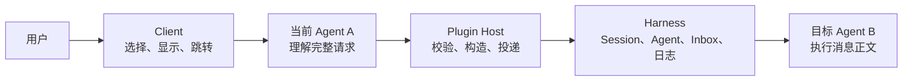
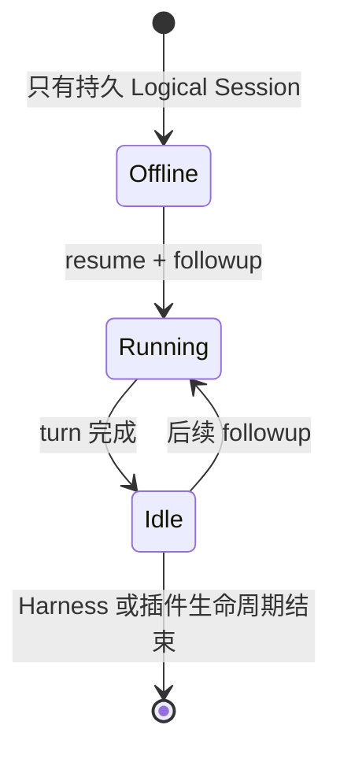

# dsh-agent-message 架构设计 v2

> 状态：已修订，作为后续实现裁决源
>
> 初稿：2026-08-14
>
> 本次修订：2026-08-15
>
> 范围：同一 DeepSeek Harness 进程内，独立 Session 之间的定位、消息投递与传输诊断。

## 1. 设计结论

本插件只做一件事：**让一个 Harness Session 能够向另一个已存在的 Session 投递消息。**

围绕这件事，固定以下边界：

1. Harness 拥有 Session、Agent runtime、Inbox、持久日志、运行状态和可见性；
2. Plugin Host 只拥有目标校验、消息构造、投递选择和必要的传输诊断；
3. Plugin Client 只拥有 `@` 会话选择、显示投影和跳转；
4. `@` 只回答“指的是哪个 Session”，不自动表示读取或发送；
5. 消息使用 Harness 原生 `UserMessage` 和原生 `MessageId`，不建立第二套消息系统；
6. 普通消息默认 `followup`；`steer` 和 `inject` 只在用户或已授权编排明确选择时使用；
7. 一次通信不得归档、卸载、隐藏或以其他方式改变目标 Session 的产品属性；
8. 回执只证明传输事实，不证明目标任务已完成；
9. 当前不设计 Result 协议、自动回复链、广播或跨进程传输。

这份架构优先服从 Harness 的公开对象和生命周期。无法通过公开 seam 稳定实现的能力，不进入当前核心合同。

## 2. 产品边界

### 2.1 当前提供

- 枚举可通信的 Session；
- 用稳定 `SessionId` 选择目标；
- 在用户明确要求发送，或 Agent 已获得持续编排授权时调用消息工具；
- 使用 `followup`、`steer` 或 `inject` 投递一条原生消息；
- 在消息中保留发送方 Session，使接收方能按需回复；
- 提供可选的传输状态查询；
- 在 Client 中显示会话引用、消息来源和跳转入口。

### 2.2 当前不提供

- 不拥有或复制 Session、Agent、Inbox；
- 不因看到 `@B` 就自动向 B 发消息；
- 不读取或复制 B 的全部上下文；
- 不把普通 fork 误判为子代理；
- 不根据 Agent 的 `idle/running` 猜测某项业务是否完成；
- 不要求 B 返回“收到”等传输确认；
- 不自动把 B 的普通回答转发回 A；
- 不建立 request/result 状态机、reply policy 或自动关联；
- 不实现跨进程、跨机器、广播、共享任务表或独立 mailbox。

按需读取属于 Harness Session Reference 或未来独立只读能力，不属于本通信插件的 Owner 范围。`@` 可以帮助 A 定位 B，但是否读取、如何读取由 A 使用正式只读能力决定。

## 3. 稳定对象与 Owner

### 3.1 对象定义

| 对象 | 定义 | 稳定性 |
|---|---|---|
| Logical Session | 由 `SessionId`、header 和持久日志表示的会话记录 | 配置 persistence 时跨重启稳定 |
| Session ID | `session-...` 形式的唯一地址 | 稳定，是唯一寻址真相源 |
| Session title | 面向用户的显示名称 | 可变，只用于展示 |
| Agent runtime | 当前进程中执行某个 Session 的 Agent | 临时，可处于 running/idle/offline |
| Message Target | Client 选择出的目标引用 | 内部只以完整 `SessionId` 寻址 |
| Relay message | 带插件来源的 Harness 原生 `UserMessage` | 由原生 `MessageId` 唯一标识 |
| Delivery receipt | 对 Inbox 接纳状态的可选诊断 | 只代表传输，不代表业务结果 |

`parentSession` 只表示分叉血缘。普通 fork 即使存在父会话，仍是独立 Session。只有 Harness 明确标记 `origin === "subagent"` 时，才按子代理过滤。

### 3.2 Owner 矩阵

| 对象或决策 | Owner | 插件权限 |
|---|---|---|
| Session ID、header、event log | Harness | 查询，不维护平行真相源 |
| Session 是否归档、是否出现在侧边栏 | Harness / 用户 | 不修改 |
| Agent runtime 和运行状态 | Harness | 观察，通过公开 Agent API 投递 |
| Inbox 和消息认领 | Harness Agent | 提交消息，读取可证明的传输事实 |
| Message Target | Plugin Client | 绑定 Session ID，做显示与导航 |
| 是否发送、选择何种模式 | 用户意图或已授权编排职责 | Agent 解释意图，Host 校验模式 |
| Relay source 和消息正文 | Plugin Host | 从真实调用上下文构造 |
| 业务回答内容 | 接收方 Agent | 按收到的正文执行；插件不代答 |

## 4. 分层架构



### 4.1 Client

Client 负责：

- 从 Host/Harness 投影可选 Session；
- 将标题和完整 `SessionId` 绑定成一个结构化选择；
- 在输入框和消息气泡中显示可读会话引用；
- 点击来源或引用时调用 Harness 导航。

Client 不决定发送，不选择投递模式，不制造传输状态，也不改变消息协议。

### 4.2 当前 Agent A

A 根据用户完整句子判断动作：

- “分析 B 的最近讨论”是读取意图，不是发送；
- “打开 B”是导航意图，不是发送；
- “告诉 B 完成后提交 draft PR”是发送意图；
- “立即纠正 B 当前的错误”是发送并选择 `steer`；
- “不打断 B，补充这份背景”是发送并选择 `inject`。

工具描述只需告诉模型：当当前请求，或用户已经授予的编排职责，明确要求向其他 Agent 或 Session 传递信息时调用。无需加入全局、持续干扰每轮推理的复杂判断提示词。

### 4.3 Plugin Host

Host 负责：

1. 从工具执行上下文派生真实 `senderSessionId`；
2. 校验目标存在、未归档、不是自身且不是子代理；
3. 校验所选投递模式当前可用；
4. 使用 Harness `createUserMessage()` 创建原生消息；
5. 通过公开 Agent API 投递；
6. 返回 `accepted` 和原生 `messageId`；
7. 可选地查询精确消息的传输状态。

模型不能传入或伪造 sender、MessageId、目标运行状态和回执状态。

### 4.4 Harness

Harness 是以下事实的唯一 Owner：

- Session 的持久记录、归档与可见性；
- Agent runtime 的创建、运行和空闲；
- Inbox 的 next-turn / next-step 队列；
- 原生消息身份和持久日志；
- `followup`、`steer`、`inject`、`resume` 的实际调度。

插件不得直接追加核心 Inbox 事件，不得调用私有 wake 方法，也不得维护第二份 pending mailbox。

## 5. `@` 的语义

`@B` 是一个**中性定位符**，等价于“下面这句话涉及 Session B”。它本身不决定动作。

| 示例 | 语义 | 是否发送消息 |
|---|---|---|
| `@B 帮我分析他最新的对话结果` | 定位后读取/分析 | 否 |
| `@B 打开` | 定位后导航 | 否 |
| `@B 告诉他最后提交 PR draft 就停止` | 定向发送新任务 | 是，默认 followup |
| `@B 立即纠正当前错误` | 介入运行中的任务 | 是，steer |
| `@B 把这份资料补充给他，不要打断` | 补充运行中上下文 | 是，inject |

Host 不扫描 Agent 生成的正文中的 `@...` 自动路由。只有一次显式工具调用才能产生消息，而且该调用必须来自当前用户的明确发送要求，或用户已经授予的持续编排职责。这样从结构上避免 A、B 因自然语言引用相互触发。

## 6. 消息合同

### 6.1 原生消息

Relay 使用 Harness 原生 `UserMessage`：

```json
{
  "id": "Harness MessageId",
  "role": "user",
  "source": {
    "kind": "dsh-agent-message",
    "form": "relay",
    "protocolVersion": 1,
    "senderSessionId": "session-a",
    "targetSessionId": "session-b",
    "senderTitle": "发送方标题快照"
  }
}
```

约束：

- `role: user` 是 Harness 当前使消息进入模型上下文的原生消息形态，不表示来源是真人；
- 真实来源由 typed source 的 `kind`、`form` 和 `senderSessionId` 表达；
- `senderTitle` 只是显示快照，身份仍是完整 `senderSessionId`；
- `targetSessionId` 供 Host/UI 校验和投影，不授权目标执行高风险动作；
- 一条 relay 只有一个 Harness 原生 `MessageId`，不再生成 envelope ID。

### 6.2 模型可见来源

当前 Harness 不会自动把自定义 typed source 完整展开给模型。因此 Host 在正文首行生成一个最小来源投影，使 B 能知道回复地址。

最小必要信息只有：

```text
<dsh-agent-message>{"senderSessionId":"session-a"}</dsh-agent-message>
```

不把 `messageId`、`targetSessionId`、reply policy、业务状态机等信息塞进模型上下文。typed source 仍是 Host/UI 的权威事实；正文首行只是当前 Harness 能力下的兼容投影。

## 7. 三种投递模式

三种模式都表示“给 B 一条信息”，差别只在调度方式。

| 模式 | 用户语义 | 目标状态 | Harness 行为 |
|---|---|---|---|
| `followup` | 排队的新任务 | running / idle / offline | running 时等待当前任务结束后形成独立 turn；idle 时立即开始；offline 时先 `resume` 再投递 |
| `steer` | 立即介入并纠正当前任务 | **仅 running** | 插入 next-step 并唤醒，在最近步骤边界被领取 |
| `inject` | 不改变当前目标，只补充背景 | **仅 running** | 插入 next-step，不额外 wake，在下一步骤读取 |

规则：

1. 默认始终是 `followup`；
2. 插件不得仅根据目标当前是 running 就自动改成 `steer` 或 `inject`；
3. `steer` 和 `inject` 必须来自用户明确语义或已授权编排策略；
4. 用户无需说出模式名；Agent 根据整句意图选择，无法判断时继续使用默认 `followup`；
5. Host 在实际调用时再次校验目标确实为 running；Client 展示的状态只作参考；
6. `steer` 不是取消正在执行的工具，而是在 Harness 可处理的最近步骤边界介入；
7. `inject` 不“唤醒”目标，因为它只允许用于本来就在运行的目标；
8. 离线目标只支持 `followup`，不对 `steer/inject` 自动降级。
9. Host 拒绝不可用模式后，Agent 可在仍符合用户意图时重新调用 `followup`；这是新的显式调用，不是 Host 自动降级。

## 8. Cold Session 与生命周期

### 8.1 正确流程



当目标未加载时：

1. 通过 `sessionQuery` 确认 Logical Session 存在且可通信；
2. 调用公开 `agents.resume()`；
3. 持有返回的 `AgentHandle`；
4. 调用 `handle.agent.followup(message)`；
5. 目标完成后保持 Harness 中正常的 idle loaded 状态；
6. 后续消息优先通过 `agents.get(sessionId)` 复用它。

### 8.2 关键纠正

旧设计要求目标一回到 idle 就调用 `AgentHandle.dispose()`。该做法错误：官方 `dispose()` 不只是停止循环，还会注销 Agent 并从当前 store 移除 Session。实际结果是目标回复后从侧边栏和 `@` 列表消失，虽然持久日志仍然存在。

因此固定以下不变量：

- **不得因为一次消息完成就在 idle 时 dispose；**
- 插件恢复的 handle 在正常运行期间保留并复用；
- handle 的最终清理绑定插件/Harness 生命周期，而不是某条消息生命周期；
- 当前 Harness 缺少“释放插件持有权但保留 Session store 投影”的公开 seam，这是上游生命周期缺口；
- 在该 seam 出现前，正常通信优先保证 Session 可见性与 Harness 一致，不能用会让会话消失的清理策略换取局部资源回收。

插件不得归档、取消归档、改标题或删除目标 Session。一次消息只改变目标 Inbox 和正常运行状态。

## 9. 回复语义

Relay 本身既不要求回复，也不禁止回复。是否回传只由消息正文决定。

- “告诉 B 最后提交 draft PR 就停止”：B 执行，不发送“收到”；
- “问 B 仓库版本号，并回复我”：B 得出答案后，用同一个 `send_agent_message` 向 `senderSessionId` 发送普通 relay；
- A 收到 B 的回复后可以向用户总结，但不得自动再回复 B；
- transport ack、`claimed` 或 B 变为 idle 都不算业务回答；
- Agent 间消息不能提升权限，提交、推送、删除等动作仍需目标 Session 原有授权。

当前不实现自动 request/result 关联。只有出现真实、可验证的机器工作流，需要“一条请求对应一个终止结果”时，才单独设计 Result；不能提前把普通对话复杂化。

## 10. 传输诊断

`send_agent_message` 成功返回：

```json
{
  "messageId": "Harness MessageId",
  "targetSessionId": "session-b",
  "state": "accepted",
  "mode": "followup"
}
```

`check_delivery` 可以保留为可选诊断，针对同一个原生 `messageId` 报告：

- `pending`：仍在 Inbox 等待；
- `claimed`：已被目标某个 turn 认领；
- `discarded`：Harness 有明确丢弃证据；
- `unknown`：证据不足。

它不能报告“已读”“已回复”或“已完成”。内存 Map 只能作为有界缓存，不能成为跨重启的稳定对象。

## 11. Client UI 兼容边界

消息卡片和可点击来源是用户体验层，不是协议层。

当前 Client 使用 `MutationObserver` 查找 Harness 已渲染的消息节点、展开折叠行、隐藏模型可见协议首行并增加来源样式。这些操作：

- 只改变浏览器中的显示，不修改 Session log 和模型上下文；
- 依赖当前 Harness DOM 结构，Harness 改版后可能失效；
- 不得参与身份、路由、回执或权限判断；
- 必须被标记为有边界的兼容层，并有浏览器回归测试。

`MutationObserver` 只处理新增或移除的局部子树；Session/Workspace 状态变化只刷新插件已经识别的会话链接，不重新扫描整个 `document.body`。

这里所说的“兼容层”不是功能无效，而是 Harness 当前没有给外部插件开放稳定的核心 user/message renderer 替换接口。未来出现官方 renderer seam 时再迁移；在此之前不为它额外建立 UI 框架。

## 12. 依赖与降级

| 侧 | 必需服务 | 缺失时行为 |
|---|---|---|
| Host | `agents`、`tools`、`sessionQuery` | 插件不加载，不自行扫描日志或仿造运行时 |
| Client | runtime、session/workspace、input trigger、UI slots | Client 扩展不加载；Host 工具仍可工作 |

全局 `systemPrompt` 不属于核心必需依赖。发送准入应优先由简短、明确的工具描述表达，减少对所有正常对话的持续干扰。

## 13. 当前实现需要收口的差距

按优先级实施：

### P0：修正 Session 生命周期（已完成）

- 删除 cold send 完成后 `whenIdle() -> dispose()`；
- 为插件恢复的 handle 建立按 Session ID 复用的生命周期管理；
- Handle 缓存只做并发去重，Harness `agents` Registry 始终是真相源；目标被并发激活时复用现有 Agent，收到 `agent/disposed` 时淘汰旧 Handle；
- 增加回归：cold Session 回复后仍出现在侧边栏、`@` 列表和 `agents.get()`；
- 验证重启后 persisted Session 仍可查询并再次恢复。

### P1：落实模式准入（已完成）

- 默认 `followup`；
- `steer/inject` 在 Host 边界要求目标 running；
- 不自动切换或降级模式；
- 覆盖 running、idle、offline 三种状态。

### P2：缩小模型干扰（已完成）

- 将发送条件收敛到工具描述；
- 删除全局 system prompt，发送准入只保留在工具合同中；
- 将模型可见来源头缩到回复必需的 `senderSessionId`；
- 保持 typed source 的完整 Host/UI 元数据。

### P3：固定 UI 兼容测试（已完成）

- 覆盖 `@` 列表、输入框 token、发送气泡和来源跳转；
- 明确 DOM 兼容选择器的失效行为；
- 不让 UI 是否美化影响消息正确性。

自动化兼容哨兵位于 `test/client-source.test.js`，固定会话过滤、稳定 ID 提交、候选状态、relay 卡片和鼠标/键盘跳转合同。2026-08-15 已在本地 Harness 依次验收 `@` 候选、输入框引用、relay 卡片与发送方跳转，且未发送测试消息。Harness DOM 选择器失配时只失去 Client 显示增强；Host 投递、typed source、稳定 Session ID 和权限校验不受影响。

Result、自动回复编排和跨进程都不进入以上阶段。等同进程基础语义稳定并出现真实需求后，再分别立项。

## 14. 验收不变量

1. 完整 `SessionId` 是唯一地址，标题变化不改变目标；
2. 普通 fork 不因存在 `parentSession` 被排除；
3. 只有明确 `origin === "subagent"` 的真实子代理被过滤；
4. `@B` 本身不读取、不发送、不唤醒 B；
5. 用户未明确要求发送，且不存在已授权编排职责时，不调用消息工具；
6. 新任务默认 `followup`，每条消息形成独立 FIFO turn；
7. `steer/inject` 只接受 running 目标，且不会被插件自动选择；
8. 每条 relay 只有一个 Harness 原生 MessageId；
9. Agent 消息明确标记真实 sender Session，不能冒充真人授权；
10. A 只报告可证明的投递状态，不代替 B 回答；
11. B 不发送 transport ack，只有正文要求时才回传业务内容；
12. B 的回复不会自动触发 A 再向 B 发消息；
13. `claimed`、idle 和普通 assistant 输出都不等于业务完成；
14. cold send 只走公开 `resume + followup`；
15. cold Session 完成后保持正常可见，不因 idle dispose 从侧边栏或 `@` 消失；
16. 插件不修改归档、标题、血缘和其他 Session 产品属性；
17. Client DOM 美化失效时，消息投递、来源和权限仍然正确；
18. 当前没有第二份 Inbox、spool、Result 状态机或跨进程 transport。

## 15. 决策记录

### 2026-08-15：纠正 idle dispose

实测 Session `session-1b3eaab8-ae3e-4b7d-8b32-a084df29bd88` 回复后从侧边栏和 `@` 列表消失，但持久记录仍存在且未归档。结合 Harness `AgentHandle.dispose()` 的公开语义，确认根因是插件在 `whenIdle()` 后 dispose，导致当前 store 投影被移除。

裁决：消息生命周期与 AgentHandle 生命周期解耦；正常通信结束不释放目标 handle。

### 2026-08-15：保留三种模式

`followup`、`steer`、`inject` 都是 Harness 的真实调度能力，用户和编排 Agent 均有明确使用场景。架构不删除能力，只限制模式语义和 Host 准入。

### 2026-08-15：删除超前协议

现阶段普通 relay 已能满足单次 Session 通信。Result、reply policy、自动关联和跨进程协议没有稳定需求与公开 seam 支撑，暂不进入核心架构。

## 16. 证据与参考

- 当前实现：[`lib/index.js`](../lib/index.js)、[`lib/client.js`](../lib/client.js)。
- `@` 与回复所有权调研：[`session-mention-routing-research-2026-08-14.md`](./session-mention-routing-research-2026-08-14.md)。
- Harness 源码证据：[`architecture-evidence-2026-08-14.md`](./architecture-evidence-2026-08-14.md)。
- 官方发展方向审计：[`harness-development-direction-audit-2026-08-14.md`](./harness-development-direction-audit-2026-08-14.md)。
- [DeepSeek Harness 开发手册](https://deepseek-harness.github.io/deepseek-harness/develop/basic/)。
- [DeepSeek Harness Session Reference](https://deepseek-harness.github.io/deepseek-harness/reference/subsystems/session-reference)。
- [Codex App Server](https://developers.openai.com/codex/app-server)：读取、inject、turn start 与 steer 分离。
- [Claude Code 跨会话消息](https://code.claude.com/docs/en/cross-session-messaging)：`@session` 定位、独立上下文和来源边界。
