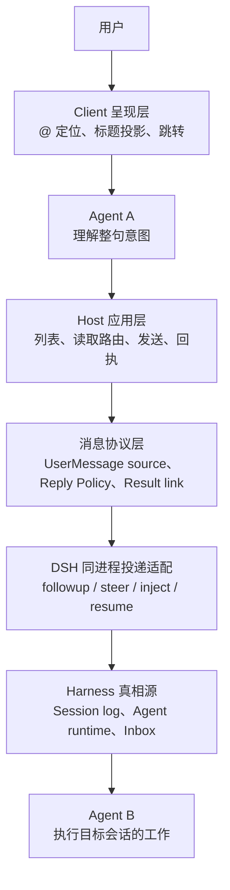
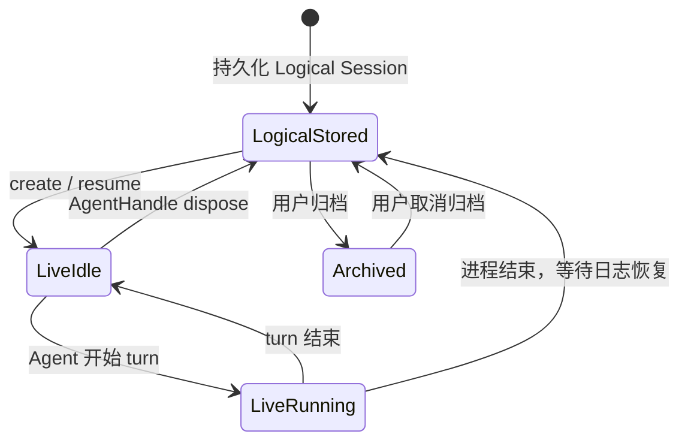
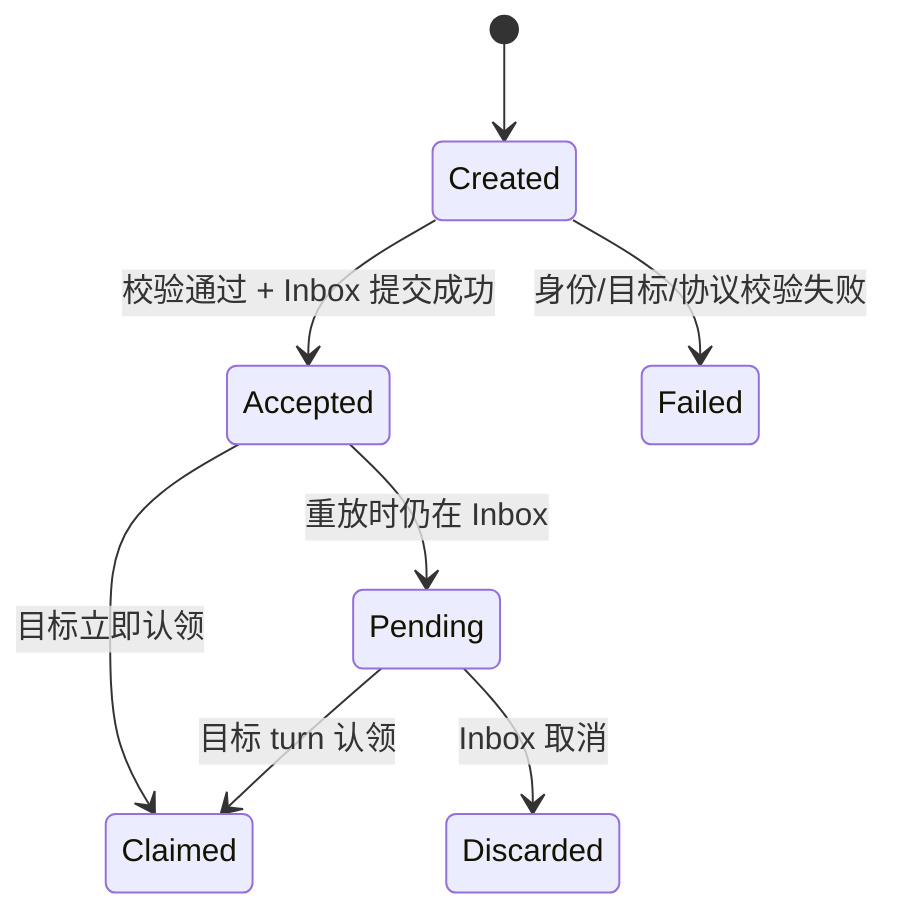
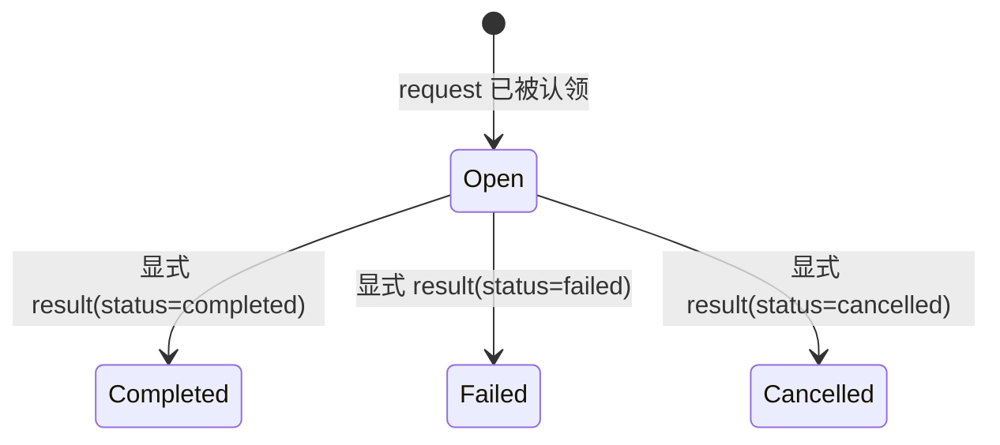

# dsh-agent-message 架构设计 v2

> 状态：评审稿
>
> 日期：2026-08-14
>
> 范围：同一 DeepSeek Harness 进程内的独立会话定位、按需读取、消息投递、结果回传和回执。
> 明确不做：跨进程、跨机器、外部服务发现、网络协议和多租户信任。

## 1. 设计目标

本文不再围绕某个 UI 或某个工具函数增补逻辑，而是先固定插件的概念、Owner 和语义。后续任何功能都必须能回答：

1. 它操作的稳定对象是什么；
2. 谁拥有该对象的真相源和生命周期；
3. 一次操作是定位、读取、发送、上下文注入还是运行中引导；
4. 谁拥有最终业务回复；
5. 什么状态是传输证据，什么状态是业务结果。

要解决的核心问题是：**一次交互只能有一条明确的回复链，传输回执不能伪装成业务回复，业务结果也不能自动变成新请求。**

## 2. 产品边界

### 2.1 插件是什么

本插件是 **DSH Session 之间的寻址与消息协作层**：

- 用稳定 `sessionId` 寻址；
- 将用户或 Agent 的显式意图转换为按需读取或单目标投递；
- 复用 Harness 的 Session、Agent、Inbox 和持久日志；
- 保留消息来源、投递证据和可选的结果关联。

### 2.2 插件不是什么

- 不是一套独立会话引擎；
- 不拥有既有 DSH Session 或 Agent runtime；仅对插件主动 `resume()` 返回的 `AgentHandle` 承担临时生命周期责任；
- 不把会话标题当成身份；
- 不把 `@` 当作“默认发送”按钮；
- 不用目标 Agent 的 `idle/running` 推断某条消息已完成；
- 不在只有一种 transport 时预先实现抽象框架。跨进程出现真实需求后，再从本文固定的协议边界接入第二种 transport。

## 3. 统一术语

| 术语 | 定义 | 稳定性 |
|---|---|---|
| **Logical Session** | 由 `SessionId`、header 与持久日志表示的逻辑会话记录 | 在配置了 persistence 时跨重启稳定 |
| **Session ID** | Logical Session 的唯一身份，如 `session-...` | 稳定，寻址真相源 |
| **Session title** | 面向人的显示投影 | 可变，不可用于投递 |
| **Live Session** | 当前 `ctx.sessions` 中由 Fiber 拥有的内存 `Session` 实例 | 短暂，可由持久日志恢复 |
| **Agent runtime** | 某个 Session 当前在 Harness 进程中的运行实例 | 短暂，重启后重建 |
| **Inbox** | Agent 的 `next-turn` / `next-step` 接纳队列 | Harness 所有，可由 Session log 重放 |
| **Message target** | `@` 选择后形成的通信目标，内部由 `SessionId` 寻址 | 身份稳定，显示可变 |
| **Relay message** | Harness 原生 `UserMessage` 加插件 typed source | 由原生 `MessageId` 唯一标识 |
| **Delivery receipt** | 说明 relay message 是否被目标 Inbox 接纳/等待/认领/丢弃 | 传输层证据 |
| **Result** | 目标 Session 针对一条 request 产生的显式业务结果 | 必须用 `replyToMessageId` 关联 |

**关键裁决：插件通信的稳定地址是 `SessionId`，不是 Live Session 或 Agent runtime。**

Logical Session 的跨重启连续性取决于 Harness persistence；Agent 只是当前是否被加载、空闲或运行的短暂执行面。因此面向用户的术语应统一为“会话”，现有 `list_peer_agents` / `send_agent_message` 可作为兼容名保留，新合同应使用 Session 语义。

官方 **Session Reference** 是另一项 opt-in recall 能力：它把其他 Session 的有界只读快照注入当前 Agent。本文的 Message Target 只负责通信寻址，不占用官方 `session-reference` source、`form: recall` 或 `dsh-session:` URI。

## 4. 架构分层



### 4.1 Client 呈现层

只负责：

- 显示由 Host/Session Query 投影出的未归档、非空白、非子代理候选 Session；
- 将标题与稳定 Session ID 绑定成结构化 Message Target；
- 在输入框、发送气泡和来源行做可读投影；
- 点击后调 Harness 原生 Session 导航。

不负责：

- 根据文案自动发送；
- 选择 `steer/followup/inject`；
- 生成第二套消息身份；
- 推断投递成功或业务完成。

长期合同不把 UI 的 `@...` 编码当作 Agent core 协议。当前 raw `@session-id` 只允许作为兼容适配；正式 Host 边界接收结构化 Message Target，并以插件来源的模型可见定位上下文表达目标。

### 4.2 Agent A（当前会话）

只负责理解用户整句意图：

- 查找/读取/分析→调用只读 Session 工具，由 A 回答；
- 告诉/通知/请求 B 执行→调用消息工具，A 只报告投递结果；
- 打开/跳转→交给 Client 导航，不读取、不发送。

A 不拥有 transport 状态，也不应用自然语言伪造“已完成”。

### 4.3 Host 应用与协议层

这是插件的真正 Owner，负责：

- 从 `exec.agent` 派生真实发送方 Session ID；
- 校验目标存在、未归档、非自身；
- 通过 Harness `createUserMessage()` 生成唯一原生 `MessageId` 和来源元数据；
- 校验 message kind 和 reply policy；
- 将业务语义映射到 DSH 投递原语；
- 去重、防循环、投影回执；
- 不接受模型伪造的 sender identity、MessageId 或传输状态；
- 优先复用标准 `user/message`、`tool/call`、`tool/result` 和 Inbox 事件；只有缺少标准事实时才追加 `ignorable: true` 的插件 log-only 投影事件。

### 4.4 Harness 适配层

只把通过协议校验的动作映射到 Harness：

- `followup`：新的、独立的 `next-turn`；
- `steer`：引导正在运行的当前 turn；
- `inject`：安静注入 `next-step`，不负责唤醒；
- `resume`：目标 cold 时恢复 Agent runtime，再通过公开 Agent API 投递。

该层不解释用户文案，不决定谁应该回答，也不直接追加核心 `agent/inbox/spliced` 或调用私有 loop 方法。插件调用 `resume()` 后拥有返回的 `AgentHandle`：必须把清理绑定到 Fiber，不能在消息刚入队后立即销毁；插件启动的运行回到 idle 后再释放该 handle。

### 4.5 服务依赖与降级

阶段 A 不为依赖创建替代实现；缺少官方服务时只关闭对应能力：

| 侧 | 服务 | 级别 | 缺失时行为 |
|---|---|---|---|
| Host | `agents`、`tools`、`systemPrompt` | 必需 | 插件不加载；不能保证寻址、显式发送入口和 A 的回复边界 |
| Host | `sessionQuery` | 必需 | 插件不加载；不自行扫描日志重建会话目录 |
| Host | `sessionPersistence` | 可选 | 仅提供 live target 投递；不列出或拒绝 cold target，不伪造离线 Inbox |
| Client | runtime、UI slots、conversation、input-trigger、primitives | 必需 | Client 扩展不加载；Host 工具仍可独立工作 |

依赖的安装、卸载和重载交给 Cordis `inject` 与 Fiber；所有监听器、节点注册和插件创建的 `AgentHandle` 都必须通过 `ctx.on()` / `ctx.effect()` 或等价公开 teardown 绑定清理。

## 5. Owner 矩阵

| 对象/决策 | Owner | 本插件的权限 |
|---|---|---|
| Session ID、header、event log | DeepSeek Harness | 只读寻址；通过公开 Session/Agent API产生事实 |
| Logical Session 查询与持久化 | DeepSeek Harness `sessionQuery` / persistence | 读取逻辑记录，不自行折叠或维护平行真相源 |
| Live Session 与既有 Agent runtime | 当前 Harness Fiber/handle Owner | 观察并通过公开 Agent API 投递 |
| 插件 cold-resume 的 Agent runtime | Plugin Host 持有的 `AgentHandle` | 绑定 Fiber 清理；运行回到 idle 后释放 |
| Inbox 队列与认领 | DeepSeek Harness Agent/Inbox | 投递与读取证据，不维护第二份邮箱 |
| 会话标题与导航 | Harness Client | 做投影和跳转，标题不参与寻址 |
| `@` 选择的 Message Target | Plugin Client | 绑定 Session ID，结构化提交给当前 Agent；不冒充官方 recall reference |
| 用户整句意图 | Agent A | 在系统合同约束下选择读取、发送或导航 |
| Relay typed source、关联、reply policy | Plugin Host | 唯一写 Owner；消息身份由 Harness `UserMessage.id` 所有 |
| Delivery receipt | Plugin Host + Harness Inbox 证据 | 只投影可证明状态，不猜测业务完成 |
| 目标任务的业务结果 | Agent B | 只有显式 Result 才能返回 Origin |
| 是否返回 Origin、是否唤醒 A | 用户意图 + Plugin reply policy | Agent B 不可自行改写 |
| 跨进程 presence、身份、传输 | 未来 transport | 当前不实现、不建第二套真相源 |

## 6. 稳定对象模型

### 6.1 Message Target

```json
{
  "sessionId": "session-...",
  "titleSnapshot": "可读标题"
}
```

- `sessionId` 是唯一身份；
- `titleSnapshot` 只用于当次 UI，显示时可再从 Session 目录取最新标题；
- `parentSession` 只是血缘/分叉信息，**不能用来判断子代理**；
- 只有 Harness 明确的 `origin/sourceKind === subagent` 才属于子代理过滤条件。
- 该对象不是官方 Session Reference；它不触发 recall snapshot，也不使用官方规范 URI。

### 6.2 Relay UserMessage

```json
{
  "id": "Harness MessageId",
  "role": "user",
  "content": [{ "type": "text", "text": "..." }],
  "source": {
    "kind": "dsh-agent-message",
    "form": "relay",
    "protocolVersion": 1,
    "messageKind": "inform | request | result",
    "senderSessionId": "session-a",
    "targetSessionId": "session-b",
    "replyToMessageId": null,
    "replyPolicy": "none | target | origin-wakeup"
  }
}
```

约束：

1. `senderSessionId` 由 Host 从调用上下文派生，不是模型参数；
2. 消息必须由 Harness `createUserMessage()` 创建；`UserMessage.id` 是协议唯一消息身份，不再生成平行 envelope ID；
3. `messageKind=result` 必须带 `replyToMessageId` 指向原生 request MessageId，且其 `replyPolicy` 强制为 `none`；
4. V1 一条 request 最多产生一条终止 Result，因此不再增加冗余的 route/correlation ID；真实出现多阶段交互后再扩展；
5. 传输回执不是消息，不进入对方 Inbox；
6. `source.kind` 固定表示插件生产方，`form: relay` 固定表示跨 Agent 定向语义；UI 形态不能反向改写这两个字段；
7. `source` 必须明确来自另一个 Session，不得伪装成人类直接输入或提升权限。

### 6.3 Delivery receipt

```json
{
  "messageId": "uuid",
  "targetSessionId": "session-b",
  "state": "accepted | pending | claimed | discarded | failed | unknown",
  "targetRuntimeStatus": "running | idle | offline"
}
```

- `accepted`：公开 Agent API 已成功把消息提交到目标 Inbox，已有原生 MessageId；
- `pending`：当前重放证据表明消息仍在目标 Inbox 等待；
- `claimed`：可证明目标某个 turn 已从 Inbox 认领；
- `discarded`：Harness 事件证明消息被取消/丢弃；
- `failed`：本次投递在 Inbox 接纳前失败；
- `unknown`：无足够证据，不是失败或完成。

`targetRuntimeStatus` 是独立观测值，不得改写消息 state。

### 6.4 持久事实与 UI 投影

| 事实 | 真相源 | 说明 |
|---|---|---|
| 目标实际收到的 request/inform/result | 标准 `UserMessage` + 插件 typed source | 模型可见，必须由 Session log 重建 |
| A 发起发送与初始 accepted 回执 | 已有 `tool/call` / `tool/result`，结果 meta 携带原生 MessageId | 优先复用核心事件，不重复记账 |
| 后续 pending/claimed/discarded 投影 | Inbox 事件；必要时追加 `ignorable: true` 的插件 log-only 事件 | 插件事件只是可丢失投影，不能成为协议正确性的唯一依据 |
| 气泡、回执、Result 卡片 | `ConversationNodeDefinition` + keyed renderer | 由稳定 MessageId 关联，不扫描 DOM、整段历史或相邻节点 |

有界内存 Map 只能作为查询缓存。插件卸载或重启后，即使专属 UI 投影消失，标准 UserMessage 与工具事件仍必须足以证明通信事实。

## 7. 对象生命周期

### 7.1 Session 与 Agent runtime



- `offline` 只表示当前进程没有 Agent runtime，不表示 Session 不存在；
- 插件调用 `resume` 后持有返回的 AgentHandle，成为该恢复实例的生命周期 Owner；清理必须绑定 Fiber，并在运行回到 idle 后释放，不能刚入队就销毁；
- 归档是 Workspace/Harness 决策，插件只拒绝投递，不自动取消归档。

### 7.2 Relay message



Message 生命周期在 `claimed` 结束。它不延伸到“Agent 完成了任务”。

### 7.3 Request/result interaction



只有显式 Result 可以证明业务结果。Agent 变成 idle、出现 assistant message 或 delivery 变成 claimed，都不能作为 completed 证据。

## 8. `@` 定位与意图语义

`@B` 在本插件中投影为 Message Target，只回答“哪个会话”，不回答“对它做什么”。它不等于官方 Session Reference 的 recall snapshot。

| 用户在 A 的输入 | 意图 | 执行者 | 谁产生对用户的回复 | 是否唤醒 B |
|---|---|---|---|---|
| `@B 帮我找上次讨论的接口结论` | 按需读取/分析 | A | A | 否 |
| `@B 分析他最新的对话结果` | 按需读取/分析 | A | A | 否 |
| `@B 打开` | 导航 | Client | 无模型业务回复 | 否 |
| `@B 告诉他最后提交 PR draft 就停止` | 定向 request | B | A 只报告投递；B 的结果默认留在 B | 是，新 turn |
| `@B 把这段背景加到下一步，不要打断他` | 安静 context | B 下一步 | A 只报告注入 | 否 |
| `@B 立即纠正他当前正在做的 X` | 显式 steer | B 当前 turn | A 只报告投递 | 是/引导当前 turn |

任何模糊句子都不因 `@` 自动发送。高风险的 `steer`、中断、删除、提交、推送等动作仍遵循原 Session 的权限和用户授权；Agent 间消息不能提升权限。

## 9. 投递语义

现有 `mode` 把业务 admission 与目标 live/cold 状态混在一起。新架构直接使用公开 Agent API，不复制 transport 状态机。

### 9.1 Admission

| 业务语义 | DSH 原语 | 默认性 |
|---|---|---|
| 新请求/通知 | `followup` → `next-turn` | **默认** |
| 安静背景 | `inject` → `next-step` 不唤醒 | 必须显式 |
| 引导当前工作 | `steer` → `next-step` 并唤醒 | 必须显式 |

**新架构不再默认 `steer`。** 新指令默认进入独立 FIFO turn，避免把无关请求混入 B 正在进行的推理。

### 9.2 Live / cold 映射

| 业务语义 | Live target | Cold target |
|---|---|---|
| request / inform | `followup(message)` | `resume()` 后 `handle.agent.followup(message)` |
| context | `inject(message)` | 暂不支持；不能手工写持久 Inbox |
| steer | 仅目标正在运行时 `steer(message)` | 拒绝，不自动降级 |

Cold activation 的 Host 负责：

1. 持有 `resume()` 返回的 `AgentHandle`；
2. 把 handle 清理绑定到插件 Fiber；
3. 消息入队后立即返回 accepted，不等待业务结果；
4. Agent 回到 idle 后释放该 handle，不让每次 cold send 永久增加 live runtime。

`leave/defer` 暂时移出稳定合同。只有 Harness 提供普通 Session 的公开 cold admission seam，或插件以自有可回放 pending 事件在恢复后再调用公开 `followup()` 时，才重新设计；不得直接追加核心 `agent/inbox/spliced`，也不得调用私有 `wakeDriver()`。

## 10. 回复所有权与结果回传

### 10.1 Reply policy

| `replyPolicy` | 含义 | A 的行为 | B 的行为 |
|---|---|---|---|
| `none` | 单向信息，不返回业务结果 | 报告投递即结束 | 可在 B 内部处理，不向 A 发回 |
| `target` | 结果留在 B | 报告投递即结束 | 结果写在 B 自己的会话，不向 A 发回 |
| `origin-wakeup` | 结果返回并明确启动 A 一次 | A 可向用户总结一次 | B 只发 Result，不要求 A 确认 |

默认规则：

- `inform` → `none`；
- `request` → `target`；
- 只有用户明确说“完成后回到这个会话/告诉我结果”时，才使用 `origin-wakeup`；
- `result` 永远是终止消息，不能要求自动回复。

`origin-quiet` 需要一个对 cold origin 也成立的公开不唤醒 admission seam。当前只对 live Agent 调 `inject()` 会让同一 reply policy 因 origin 是否在线而改变保证，因此 V1 不提供；等 cold admission 有稳定合同后再评估。

### 10.2 解决 A/B 来回确认

以 `A @B 告诉他最后提交 PR draft 就停止` 为例：

1. A 解释为 `messageKind=request`、`replyPolicy=target`；
2. Host 通过 `createUserMessage()` 创建一条带 relay source 的原生消息；
3. 目标 B 收到一个新的 `next-turn`，不污染当前 turn；
4. A 只告诉用户“已投递”，不提交 PR，不等待 B 回“收到”；
5. B 执行任务，结果留在 B 自己的会话；
6. B 不向 A 发回普通 request，因此 A 不会被再次唤醒；
7. 用户可点击 A 气泡中的 Message Target 跳转 B 查看。

如果用户改为“完成后回来告诉我结果”：

1. request 带 `replyPolicy=origin-wakeup`；
2. B 完成后只能通过显式工具创建一条新的原生消息，其 source 为 `messageKind=result`、`replyToMessageId=<requestId>`；
3. Host 拒绝 Result 再带 reply policy，从协议结构上截断 ping-pong；
4. Host 对 A 执行一次 `followup(result)`，A 最多启动一次做总结；
5. A 的总结不自动回发 B；Host 不从 B 的 assistant message、idle 或 turn/end 自动生成 Result。

## 11. 循环和失控保护

同进程阶段先固定下列结构规则：

1. 只接受人类 Composer 产生的结构化 Message Target，不扫描 Agent 消息正文里的 `@...` 自动路由；
2. Host 对原生 `MessageId` 幂等去重；
3. `result` 必须指向已存在的 request，且不可回复 result；
4. 传输回执不进入对方 Inbox；
5. Agent 自主转发必须是新的显式工具调用，不从自然语言回复自动派生；
6. 当前不做广播和多目标 fan-out；一条 relay message 只有一个 target。

跨进程前再增加 TTL/hop limit、速率限制、准入和签名。当前不为未实现的 transport 堆空抽象。

## 12. 功能语义清单

| 能力 | 稳定语义 | 明确不做 |
|---|---|---|
| 会话列表 | 枚举可寻址 Session，标题是投影，运行态是瞬时观测 | 不把 parentSession 当子代理标记 |
| `@` 定位 | 绑定 Message Target，让 A 知道去哪里 | 不冒充官方 recall reference，不默认发送 |
| 按需读取 | A 使用 `sessionQuery` 驱动的只读搜索/读取工具 | 不唤醒 B，不自动复制全量日志 |
| inform | 定向单向信息，默认新 turn | 不期待结果回传 |
| request | 请 B 执行/回答，默认新 turn | 不默认 steer，不默认回传 A |
| context | 对 live target 安静注入下一步 | 不为 cold target 伪造持久 Inbox |
| steer | 显式引导正在运行的 turn | 不作为默认消息模式 |
| delivery receipt | 只说明 Inbox 事实 | 不表示业务完成/已回复 |
| result | request 的显式终止结果 | 不要求自动回复或再次确认 |
| 导航 | 打开已知 Session | 不读取、不唤醒、不投递 |

## 13. 业内方案借鉴与裁决

本文参考成熟产品和开源框架，不照搬其 UI 或运行时，而是抽取已经被反复验证的协议边界。

| 参考方案 | 已验证的成熟做法 | 本插件的裁决 |
|---|---|---|
| [DeepSeek Harness 架构](https://deepseek-harness.github.io/deepseek-harness/reference/) | 一切能力通过插件与公开 seam 组合；模型可见内容必须由 Session log 重建；持久事实、实时 Agent 控制和 UI 投影各有 Owner | **作为首要约束。** 只使用公开 Agent API；通信消息复用原生 UserMessage；UI 使用事件驱动节点；不伪造核心 Inbox 事件 |
| [DeepSeek Harness Session Reference](https://deepseek-harness.github.io/deepseek-harness/reference/subsystems/session-reference) | 结构化 Session 引用在入队前生成有界 recall snapshot，不把宿主 mention 语法传进 Agent core | **协议隔离。** 本插件的 `@` 是 Message Target，不使用官方 URI/source/form，也不自动复制目标上下文 |
| [Codex App Server](https://developers.openai.com/codex/app-server) | `thread/read` 只读历史；`thread/inject_items` 只增加模型可见历史、不启动 turn；`turn/start` 新建生成；`turn/steer` 只作用于正在进行的 turn；fork 创建新 thread ID，血缘另记 | **直接采用分离语义。** DSH 中对应按需读取、`inject`、`followup`、`steer`；`parentSession` 只表示血缘，不决定会话是否独立或是否为子代理 |
| [OpenAI Agents 编排](https://developers.openai.com/api/docs/guides/agents/orchestration) | 先决定最终回复 Owner；handoff 让专家接管回复，agents-as-tools 则由管理者保留回复权 | **采用回复所有权原则，不混合两种模式。** 跨独立 Session 的 request 默认由 B 执行、结果留在 B；只有显式 reply policy 才把 Result 返回 A |
| [Claude Code 跨会话消息](https://code.claude.com/docs/en/cross-session-messaging) | `@session` 只定位目标，由当前 Claude 解释要发送的内容；消息是文本，不复制会话历史或文件；运行中的接收方在工具调用之间读取，不能打断正在执行的工具；接收方知道来源是另一个 Session，而不是用户；重复消息和队列有保护 | **直接采用定位、来源和不打断原则。** `@` 不自动发送；新请求默认 `followup`，不用 `steer` 打断当前工作；Agent 消息不能当成人类授权。跨进程 socket、队列上限和网络身份等到阶段 D 再设计 |
| [Claude Code Agent Teams](https://code.claude.com/docs/en/agent-teams) | 每个成员拥有独立上下文，以 mailbox 通信；消息写入成功才算发送；成员间消息不等于用户授权 | **采用独立上下文、邮箱事实和权限边界。** 不复制其 lead、共享任务表和 team 生命周期，因为本插件面对的是平级、长期存在的独立 Session |
| [AutoGen 消息通信](https://microsoft.github.io/autogen/stable/user-guide/core-user-guide/framework/message-and-communication.html) | 消息是可序列化数据；发送方身份由运行时上下文提供；直接消息可返回处理结果；广播是单向的，发布者不接收自己的广播 | **采用 typed source、Host 派生 sender、单目标和显式 Result。** 消息容器继续使用 Harness UserMessage，当前不做广播、群聊和自动 Agent 循环 |
| [AutoGen 终止条件](https://microsoft.github.io/autogen/stable/user-guide/agentchat-user-guide/tutorial/termination.html) | 自动对话必须有显式停止条件，不能靠模型自行约定“聊完了” | **采用结构化终止。** `result` 是 request 的终止消息，禁止继续自动回复；传输回执不参与业务对话 |

### 13.1 直接采用的共同原则

1. 稳定身份与显示名分离；血缘与身份分离；
2. 读取、注入、新 turn、steer 是不同语义；
3. 每次交互先确定唯一的最终回复 Owner；
4. Agent 消息携带来源，但不获得用户权限；
5. 消息、回执、业务结果是三类对象；
6. 自动链必须有结构化终止，不能靠自然语言“收到/确认”收尾。

### 13.2 按 DSH 调整的部分

- 不另建 Session、Agent 或 Inbox；Harness 已经拥有这些对象；
- 不照搬 Codex/Claude 的 UI token，Client 只投影插件 Message Target；
- 不把 Claude 的纯文本回复直接当协议结果；本插件用 `messageKind=result` 和 `replyToMessageId` 消除歧义；
- 不引入 Agent Teams 的 lead/teammate 组织模型，Session 默认平级；
- 不引入 AutoGen 的广播与群聊管理器，当前只允许单目标投递。

### 13.3 明确暂缓

- 跨进程 socket、跨机器发现、签名、租户身份；
- 广播、多目标 fan-out、共享任务表；
- 自动协商、自动转发、Agent 自主组网；
- 独立于 Harness 的 mailbox、spool 或 presence 数据库。

这些能力只有在同进程的语义、幂等和防循环规则稳定后才有资格进入设计。

## 14. 当前实现与目标架构的差距

| 现状 | 问题 | 目标 |
|---|---|---|
| 工具命名为 `*_agent_*` | 稳定对象实际是 Session | 新合同使用 Session 语义，旧名作兼容别名 |
| 把 live `Session` 写成天然持久对象 | Live Session 实际由 Fiber 拥有，跨重启依赖 persistence | 稳定地址定义为 `SessionId + Logical Session` |
| 通信目标也叫 Session reference | 与官方 recall snapshot seam 冲突 | 内部改名 Message Target，与官方 URI/source/form 隔离 |
| raw `@session-id` 进入普通 prompt | 宿主 UI 编码泄漏进 Agent core | 仅作兼容层；正式 Host 边界接收结构化 target |
| `parentSession` 被用来推导 `kind=subagent` | 普通 fork 也可有 parent | 只使用 Harness 明确 origin/sourceKind |
| 在线默认 `steer` | 新请求会污染 B 当前 turn | 新请求默认 `followup` |
| `leave` 手工追加核心 Inbox + 私有 wake | 绕过公开 seam 与 Owner | stable contract 删除 leave；cold target 只用 `resume + followup` |
| cold resume 未声明 handle Owner | 可能泄漏或过早销毁 runtime | Plugin Host 绑定 Fiber，idle 后释放 handle |
| 全局 `form=user|relay` | 视觉形态与消息语义耦合 | source 固定 plugin + relay，视觉由 Client 投影 |
| `source.kind=user` 的 Agent 消息 | 可能被误解为人类直接授权 | typed source 明确来自插件和 sender Session |
| 只有传输回执 | 无法表示 request 的业务结果 | 新增显式 Result，不从 idle/普通回复猜测 |
| 回复使用普通消息 | A/B 容易相互唤醒和确认 | Result 终止、不可回复，默认不回传 |
| 插件自建随机 `messageId` | 与 Harness UserMessage 形成双重身份 | 只使用 `createUserMessage()` 生成的原生 MessageId |
| `sent Map` 承担发送记录 | 重启后丢失，不能作为裁决源 | 只作缓存；真相来自 UserMessage、工具事件和 Inbox 事件 |
| DOM 扫描/改写消息头 | 依赖当前页面结构，无法可靠回放与分页 | 迁移到 ConversationNodeDefinition + keyed renderer |

## 15. 分阶段实施路线

执行规则：按工作包顺序推进；当前工作包通过代码检查、自动化测试和 Harness smoke test 后，才进入下一项。每完成一项就在本文勾选，本文是唯一实施清单。

### 阶段 A：通信内核稳定化（当前阶段）

- [x] **A0 架构裁决收口**
  - 固定 Logical Session / Live Session / Agent runtime、Owner、Message Target、Receipt 与 Result 语义；
  - 完成官方发展方向审计和证据对账。

- [x] **A1 公开且安全的投递路径**（2026-08-15 完成）
  - 删除手工 `agent/inbox/spliced`、私有 `wakeDriver()` 和 stable `leave/defer`；
  - request/inform 默认 `followup`；`steer/inject` 仅用于明确意图和 live target；
  - cold target 只走公开 `resume + followup`，插件持有并在 idle 后释放 `AgentHandle`；
  - 验收：代码中不存在私有 wake 或核心 Inbox 伪造；live/cold/拒绝路径测试与 Harness smoke test 通过。

- [ ] **A2 原生消息身份与 typed source**
  - 删除 `mintId()` 和自建 Message 容器，统一使用 `createUserMessage()` 与原生 `MessageId`；
  - 固定插件 producer、`form: relay`、sender/target、message kind 和 reply policy；
  - Receipt 收敛为 `accepted/pending/claimed/discarded/failed/unknown`，UI 不再决定 source 语义；
  - 验收：一条 relay 只有一个原生 MessageId，重放仍能识别来源和关联，现有用户可见入口无意外退化。

- [ ] **A3 回复所有权与防重复确认**
  - 同步工具合同、SystemPrompt 和返回文案：A 发送后只报告投递，B 不承担 transport ack；
  - B 的普通结果默认留在 B；Host 不扫描 Agent 正文中的 `@`，不自动回传或再次路由；
  - 验收：读取、导航、发送三条路径互斥；同一请求只有一个业务回复 Owner，A/B 不出现确认循环。

- [ ] **A4 Session 查询与目标边界**
  - 列表、搜索、标题和逻辑记录统一使用 `sessionQuery`；
  - `SessionId` 是唯一地址；`parentSession` 只表示血缘，子代理只按明确 `origin/sourceKind` 过滤；
  - Message Target 与官方 Session Reference 隔离；raw `@session-id` 只保留为兼容适配；
  - 验收：普通 fork、归档、空白、subagent、live/cold 和标题变化场景均按合同工作。

### 阶段 B：结果协议

阶段 A 全部完成后开始：

1. 增加显式 Result 工具协议；Result 仍是带 typed source 的原生 UserMessage；
2. 先实现 `target` 与显式 `origin-wakeup`；cold-safe 的 `origin-quiet` 暂缓；
3. Result 通过 `replyToMessageId` 关联 request，不从普通 assistant 输出或 idle 推断；
4. 用持久工具/消息事实和 Conversation Node 呈现关联结果；
5. 验证一条 request 最多产生一条终止 Result，重复 Result 幂等。

### 阶段 C：准入与防失控

阶段 B 完成后开始：

1. 信任策略：Agent 消息默认是信息，不自动提升权限；
2. 大小限制、速率限制、重复正文抑制；
3. 一次单目标、Result 终止、明确的失败返回；
4. 完成后再评估是否具备跨进程的安全前提。

### 阶段 D：跨进程（暂缓）

只在阶段 A–C 稳定后开始。出现第二个 transport 时再按 Definition / Provider / Consumer 拆 seam；新 provider 必须复用同一 typed source、reply policy 和 receipt，不允许重新定义业务语义。

## 16. 验收不变量

1. 显示名变更不改变实际 Session 目标；
2. 普通 fork 会话不因有 `parentSession` 被当作子代理排除；
3. Message Target 与官方 recall Session Reference 在名称、URI、source 和 form 上隔离；
4. `@B` 本身不唤醒 B；
5. 读取/分析 B 时只有 A 回答；
6. 新 request 默认进 B 的独立 FIFO turn，不混入 B 当前 turn；
7. 每条 relay 只存在一个 Harness 原生 MessageId；
8. Agent 消息的 source 固定表明插件与 sender Session，不能伪装为真人输入；
9. A 不代替 B 执行被转发的任务；
10. A 只报告可证明的投递状态，不宣称 B 已完成；
11. B 的普通回复不自动唤醒 A；
12. 返回 A 的 Result 必须关联 request，且 Result 不可再次自动回复；
13. 回执状态与 Agent runtime 状态分开；对方 idle 不等于任务 completed；
14. cold send 只通过 `resume + followup`，且 AgentHandle 最终被释放；
15. 归档、不存在、自身目标在 Host 边界被拒绝；
16. 传输回执不作为新消息投递到任何 Agent；
17. 插件自有 log-only 事件即使缺失，也不破坏消息与关联正确性；
18. 当前不直接追加核心 Inbox，不引入第二份 Inbox、独立 spool 或跨进程 presence。

## 17. 未决产品问题

本评审稿只留一个需要在实现 Result 前裁决的问题：Result 首版是在现有消息/工具节点中做最小关联投影，还是增加独立可点击结果卡。建议先复用现有节点数据；只有它无法清楚表达 request/result 关系时，再增加独立 Conversation Node。

## 18. 证据与参考

- 仓库现有行为：[`lib/index.js`](../lib/index.js)、[`lib/client.js`](../lib/client.js)、[`docs/design-v1.2.md`](./design-v1.2.md)。
- `@` 与回复所有权调研：[`docs/session-mention-routing-research-2026-08-14.md`](./session-mention-routing-research-2026-08-14.md)。其中“宿主直接路由”已被本文的“`@` 仅定位”裁决取代。
- 一手源码证据：[`docs/architecture-evidence-2026-08-14.md`](./architecture-evidence-2026-08-14.md)。
- 官方发展方向审计：[`docs/harness-development-direction-audit-2026-08-14.md`](./harness-development-direction-audit-2026-08-14.md)。
