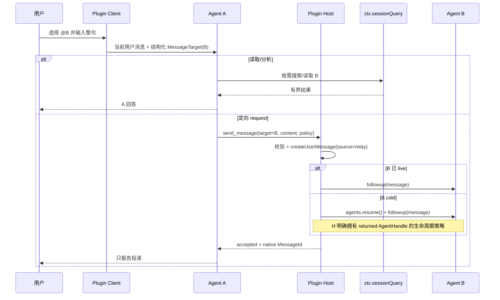

# DeepSeek Harness 官方发展方向审计

> 审计对象：[`docs/architecture-v2.md`](./architecture-v2.md)  
> 官方文档入口：[DeepSeek Harness 开发手册](https://deepseek-harness.github.io/deepseek-harness/develop/basic/)  
> 官方源码快照：[`deepseek-ai/deepseek-harness@47f9438`](https://github.com/deepseek-ai/deepseek-harness/tree/47f943859bef60e4160492346772ded9b24f765a)  
> 审计日期：2026-08-14  
> 范围：对象、Owner、生命周期、`@` 定位、`followup` / `steer` / `inject`、Envelope / Receipt / Result、同进程边界，以及插件开发原则。

## 1. 结论

`architecture-v2.md` 的**核心方向没有违背 Harness**：插件化扩展、复用 Session/Agent/Inbox、不建第二份邮箱、默认 `followup`、显式 `steer`、Receipt 与 Result 分离、同进程先行和暂不拆 transport seam，都与官方设计一致。

但它**不能按当前文字原样进入实现**。有五项需要在阶段 A 前修正：

1. 稳定地址应写成 `SessionId` / logical session，而不是把 live `Session` 对象描述成天然跨重启稳定；持久性取决于 `sessionPersistence`。
2. 插件调用 `ctx.agents.resume()` 后会取得并拥有 `AgentHandle`，不能继续声称 runtime 完全由 Harness 拥有而插件没有生命周期责任。
3. Envelope 不应再生成第二个 `messageId`；Harness 的不可变 `UserMessage.id` 已经是 Inbox、日志和模型请求之间的唯一消息身份。
4. `MessageSource.kind` 与 `form` 是来源和内容语义，不是气泡样式开关。Agent 间消息应保留插件来源并使用 `form: 'relay'`，UI 是否画成气泡另行决定。
5. “离线 defer/leave 直接追加 `agent/inbox/spliced`，恢复时调用私有 `wakeDriver()`”不是公开扩展 seam。当前可靠路径应收敛为 `resume + followup`；真正不唤醒的冷留言须等待官方 seam，或另做不触碰核心 Inbox 的插件事件设计。

还有一项高风险语义碰撞：官方已有名为 **Session Reference** 的 opt-in 能力，其 `@` 引用表示“把其他会话的有界只读快照注入当前 Agent”，并不表示消息地址。我们可以继续把 `@` 设计为“消息目标定位”，但内部必须改名为 `SessionAddress` / `MessageTarget`，并与官方 `dsh-session:` URI 和 `session-reference` source 隔离。

## 2. 如何阅读本审计

本文严格区分三类结论：

- **官方明确事实**：公开文档、类型或当前源码直接规定；插件应遵守。
- **合理推论**：由多个官方契约共同导出的兼容方向；不是官方对本插件的直接要求。
- **本插件产品裁决**：Harness 没有规定，由我们决定，但必须建立在公开 seam 上。

“官方没有定义”不等于“禁止”。Envelope、Result、独立 Session 间通信都属于插件可以增加的产品协议；关键在于不能伪造 Harness 已经拥有的身份、状态或生命周期。

## 3. 官方开发原则

| 原则 | 官方明确事实 | 对本插件的影响 |
|---|---|---|
| Everything is a Plugin | Harness 的模型适配器、工具、Session 日志和 Agent loop 都是 Cordis 插件；扩展方式是把插件挂在已有插件旁，而不是修改特权内核。[架构](https://deepseek-harness.github.io/deepseek-harness/reference/) | 当前独立插件方向正确；不要 patch Agent loop 或调用其私有方法 |
| 依赖显式声明 | 必需服务通过 `inject` 声明；依赖消失时插件卸载，恢复后重载。[服务与依赖](https://deepseek-harness.github.io/deepseek-harness/develop/framework/service) | 架构文档应列出 required/optional service，而不是只写逻辑分层 |
| 副作用可逆 | `ctx.on()`、工具注册和 `ctx.effect()` 绑定 Fiber 生命周期，卸载时自动清理。[插件生命周期](https://deepseek-harness.github.io/deepseek-harness/develop/framework/) | Host 注册、Client 插槽、监听器和恢复出的 handle 都必须有明确 teardown |
| 使用已有扩展点 | 持久事实用 Session events；运行中控制用 `agent/*`；能力策略用所属 seam 事件。[架构：事件域](https://deepseek-harness.github.io/deepseek-harness/reference/#events) | 不维护与 Session log 并行的持久真相，也不调用 loop 私有入口 |
| 模型可见即已记录 | 任何进入模型请求的内容必须能从 Session log 重建。[架构：会话日志](https://deepseek-harness.github.io/deepseek-harness/reference/#session-log) | relay / result 若对模型可见，必须作为标准 `user/message` 进入日志，来源写入 `source` |
| 不预防性拆分 | Definition / Provider / Consumer 只在需要独立演进或替换时拆包；简单插件无需拆。[能力分层](https://deepseek-harness.github.io/deepseek-harness/develop/practice/) | 当前单包正确；出现第二个 transport 后再提升为 seam |
| 显式语义优于隐藏默认 | 官方能力分层建议用显式 resolve 步骤处理默认值，Service Definition 拥有 Request/Result 类型。[能力分层](https://deepseek-harness.github.io/deepseek-harness/develop/practice/) | Admission、Activation、Reply Policy 可以作为产品协议，但默认值必须可见且可测试 |
| UI 从事件增量渲染 | 业务 UI 行应由持久事件族、稳定业务 id、`ConversationNodeDefinition` 与 keyed renderer 构造，不扫描历史窗口或已渲染 DOM。[Conversation Node 指南](https://deepseek-harness.github.io/deepseek-harness/reference/cookbook/adding-a-conversation-node) | 当前基于 DOM 扫描/改写的客户端实现不是长期方向；协议 UI 应迁移到官方节点 seam |

## 4. 逐项核对

### 4.1 对象与 Owner

| `architecture-v2` 裁决 | 结果 | 核对 |
|---|---|---|
| Session 是稳定对象，Agent runtime 是短暂执行面 | **部分符合，需改名** | 官方 `Agent.id` 与 live `Session.id` 共用同一个 `SessionId`，但 `Session` 本身是 live 内存对象；跨重启存在的是持久化后端中的 logical session。官方类型见 [`Agent`](https://github.com/deepseek-ai/deepseek-harness/blob/47f943859bef60e4160492346772ded9b24f765a/packages/core/agent/src/runtime-types.ts#L64-L76) 和[会话持久化](https://deepseek-harness.github.io/deepseek-harness/reference/subsystems/persistence) |
| Session ID 是寻址真相源，标题只是显示投影 | **符合** | 官方 `SessionReferenceInput` 明确 id 权威、label 是显示元数据；Session Query 也以 `SessionId` 为逻辑记录身份。[会话引用](https://deepseek-harness.github.io/deepseek-harness/reference/subsystems/session-reference) |
| `parentSession` 只是血缘，不能据此判断子代理 | **符合** | 官方 `SessionHeader` 分开定义 `parentSession` 和 `origin?: 'subagent'`，并明确 `origin` 是粗粒度产品分类。[会话持久化](https://deepseek-harness.github.io/deepseek-harness/reference/subsystems/persistence#sessionheader-metadata-beside-the-log) |
| Harness 拥有 Agent runtime，插件只观察/恢复 | **不完整** | 已存在的 Agent 确实由其当前生命周期 Owner 管理；但谁调用 `ctx.agents.resume()`，谁就通过返回的 `AgentHandle` 取得 teardown capability。官方明确调用方 context 与 AgentLoop provider 共同拥有该 runtime。[`AgentHandle`](https://github.com/deepseek-ai/deepseek-harness/blob/47f943859bef60e4160492346772ded9b24f765a/packages/core/agent/src/index.ts#L160-L213) |
| Inbox 由 Harness Agent/Inbox 拥有，不维护第二份邮箱 | **符合** | Inbox 是 Agent-owned 的 durable pending-work projection；所有正常投递都应走公开 `Agent.send/followup/steer/inject`。[Agent API](https://github.com/deepseek-ai/deepseek-harness/blob/47f943859bef60e4160492346772ded9b24f765a/packages/core/agent/src/runtime-types.ts#L106-L143) |
| 读取会话由 Host 自己枚举/折叠 | **应收敛到官方 seam** | 官方已有 `ctx.sessionQuery`，统一 live-preferred 的列表、标题、精确 surface、过滤、搜索和谱系。插件应优先依赖它，而不是自行遍历每份日志。[Session Query](https://deepseek-harness.github.io/deepseek-harness/reference/subsystems/session-query) |

建议把对象名改成：

```text
SessionAddress = SessionId
LogicalSession = ctx.sessionQuery 中 live-preferred 的逻辑记录
LiveSession = 当前 ctx.sessions 中的 Session 实例
AgentRuntime = 当前 ctx.agents 中与同一 SessionId 绑定的执行实例
```

这样既保留“面向会话通信”的产品语言，也不会把 live 对象与持久记录混成一个生命周期。

### 4.2 `@` 定位

#### 官方明确事实

官方已经提供 opt-in 的 `ctx.sessionReferenceResolver`：

- 宿主使用结构化 `{ sessionId, label? }`，id 权威；
- 规范文本形式是 `@[label](dsh-session:<encoded-id>)`；
- 宿主语法不会进入 Agent core；
- `prepare()` 在入队前读取所引用 Session 的当前 surface，生成有界、不可信、只读的 recall snapshot；
- 该快照以 `source.kind = 'session-reference'`、`form = 'recall'` 注入当前 Agent；
- 它不是实时链接、fork、resume 或消息投递。

证据：[会话引用文档](https://deepseek-harness.github.io/deepseek-harness/reference/subsystems/session-reference)、[`SessionReferenceResolver.prepare()`](https://github.com/deepseek-ai/deepseek-harness/blob/47f943859bef60e4160492346772ded9b24f765a/packages/context/session-reference/src/index.ts#L161-L216)。

#### 本插件产品裁决

我们的 `@B` 不自动复制 B 的上下文，只给 A 一个稳定目标，让 A 根据整句决定读取、发送或导航。这是合理的独立产品语义，官方没有禁止。

#### 冲突与调整

当前文档把该对象也叫 `Session reference`，而实现依靠 raw `@session-id` + SystemPrompt 让模型识别，容易与官方 recall seam 发生三种碰撞：

1. 同一个 `@` 在一个组合中可能同时表示 recall 和 message target；
2. raw token 把宿主 UI 编码泄漏进 Agent core，而官方方向是结构化输入；
3. 若错误复用官方 `dsh-session:` URI，宿主可能先注入 snapshot，再由 A 发送，造成用户没有要求的上下文复制。

建议：

- 产品 UI 仍可显示 `@标题`；
- 内部对象改名为 `SessionAddress` 或 `MessageTarget`；
- 使用插件自有结构化 payload/source 携带 `targetSessionId`，不要占用 `session-reference` kind、`recall` form 或 `dsh-session:` URI；
- A 仍然读取整句并显式调用 read/send 工具，**不要改为 Host 看见 `@` 就直接路由**；
- read/analyze 路径使用 `ctx.sessionQuery` 提供的只读能力，按需搜索，而不是自动 snapshot 全会话。

结论：`@` 的产品语义可以保留，但必须与官方 Session Reference 做命名和协议隔离。

### 4.3 `followup`、`steer`、`inject`

官方公共 API 已把三者定义为固定 preset：

| API | 官方语义 | 架构结论 |
|---|---|---|
| `followup(message)` | 进入 `next-turn` FIFO 并唤醒；每条普通消息独占自己的 turn | 新 request 默认 `followup` **明确符合** |
| `steer(message)` | 进入 `next-step` 并唤醒；运行中在最近步骤边界领取，idle 时会启动 turn | 仅用于用户明确要求引导当前工作 **明确符合** |
| `inject(message)` | 进入 `next-step` 但不唤醒；等待下一次 pre-step | 安静 context **明确符合**，但不能承诺一定进入“下一次已经开始组装的请求” |

官方类型与时序见 [`Agent` API](https://github.com/deepseek-ai/deepseek-harness/blob/47f943859bef60e4160492346772ded9b24f765a/packages/core/agent/src/runtime-types.ts#L106-L143) 和 [Agent 生命周期](https://deepseek-harness.github.io/deepseek-harness/reference/agent-lifecycle)。

`architecture-v2` 把 Admission 与 Activation 分开属于合理的产品模型，但不要为此复制一层 transport state machine；底层仍直接映射到上述公开 API。

### 4.4 离线 `leave/defer`

这是当前设计中最接近违背官方扩展理念的一项。

#### 官方明确事实

- `agent/inbox/spliced` 是 Agent Inbox 自己产生的持久队列事实；
- `Agent.followup()` 同步提交 Inbox 插入并唤醒；
- 官方 continuable subagent 在目标缺席时采用“从持久 Session 冷恢复 Agent，再通过它自己的 Inbox followup”，并明确 Inbox 是唯一队列；
- `wakeDriver()` 是具体 `ReactLoopAgent` 的包内部方法，不在公开 `Agent` 接口中；
- 新行为应附加到公开 service/event seam，而不是点名或驱动 loop 内部组件。

证据：[Agent Loop README](https://github.com/deepseek-ai/deepseek-harness/blob/47f943859bef60e4160492346772ded9b24f765a/packages/core/agent-loop/README.md)、[扩展实操手册](https://deepseek-harness.github.io/deepseek-harness/reference/cookbook/extension-cookbook)。

#### 对当前目标架构的裁决

`persisted inbox：目标未加载时直接 next-turn 持久投递，未来打开再唤醒` 暂无面向普通独立 Session 的官方公共 admission seam。直接调用 `sessionPersistence.append()` 伪造核心 `agent/inbox/spliced`，再在恢复时调用私有 `wakeDriver()`，会绕过 Inbox 的校验、事件顺序、所有权与未来实现替换。

阶段 A 应收敛为：

```text
live target -> target.followup(message)
cold target -> ctx.agents.resume(...) -> handle.agent.followup(message)
```

`leave/defer` 先移出稳定合同。只有出现以下任一条件时再恢复：

1. Harness 提供普通 Session 的官方 cold admission seam；或
2. 插件以自有、可回放的 pending 事件实现“待投递意图”，并在 Agent 正式恢复后通过公开 `followup()` 转交；该队列不能伪装成核心 Inbox。

### 4.5 Envelope 与 Message 身份

#### 官方明确事实

Harness 已有一份投递、持久历史和模型请求共享的不可变 `Message`：每条消息从创建起就带 `MessageId`、role、content 和 typed source；`createUserMessage()` 使用 `crypto.randomUUID()` 生成 id，并在所有边界保留它。[`Message` 与构造函数](https://github.com/deepseek-ai/deepseek-harness/blob/47f943859bef60e4160492346772ded9b24f765a/packages/llm/llm/src/message.ts#L128-L199)。

`architecture-v2` 再定义一份拥有独立 `messageId`、content、sender、target 的 Envelope，会产生两个消息身份和两个内容 Owner。

#### 建议调整

不要增加平行消息容器。采用：

```ts
UserMessage {
  id: MessageId,               // Harness 唯一消息身份
  role: 'user',
  content: ContentBlock[],
  source: {
    kind: 'dsh-agent-message',  // 插件生产方
    form: 'relay',              // Agent 间定向消息的语义
    protocolVersion: 1,
    senderSessionId,
    targetSessionId,
    correlationId,
    messageKind,                // inform | request | result
    replyToMessageId?,
    replyPolicy,
  }
}
```

其中：

- `Envelope.messageId` 若为兼容字段，必须严格等于 `UserMessage.id`，不能再次生成；
- `correlationId` 是插件业务链 id，可以独立存在；
- sender 必须从 `exec.agent.id` 派生；
- target 是工具参数并经 Host 校验；
- 所有对象通过 Harness `createUserMessage()` 构造并冻结。

### 4.6 `kind`、`form` 与视觉

官方源码明确规定：

- `MessageSource.kind` 回答“谁产生了内容”；
- `form` 回答“它是什么语义”；
- `form` **绝不是视觉词汇**；颜色、图标、排序、折叠与气泡由消费者决定；
- `form: 'relay'` 的官方定义正是“另一个 Agent 定向发来的消息”。

证据：[`ContextForm` 与 `MessageSourceMap`](https://github.com/deepseek-ai/deepseek-harness/blob/47f943859bef60e4160492346772ded9b24f765a/packages/llm/llm/src/message.ts#L32-L105)。

因此当前 `form=user|relay` 配置把“视觉气泡”与“消息语义”混在一起，且 `source.kind='user'` 会把 Agent 消息标成人类来源。目标架构应明确：

- Agent 间消息始终保留插件 producer kind；
- 其语义 form 使用 `relay`；
- request/result/inform 用插件 source 内的独立字段区分；
- Client 可以把 relay 画成气泡、上下文行或业务卡片，但不能反向改写 source 语义。

这也支持此前的产品裁决：user-facing 消息可有更好的视觉和跳转，relay 上下文可保持克制；两者只是同一语义事实的不同投影。

### 4.7 Delivery Receipt

Receipt 与 Result 分离的方向正确，但当前状态名需要贴近官方可证明事实。

#### 官方明确事实

- `MessageId` 可证明 Inbox 准入；
- `agent/inbox/spliced` 持久记录插入、删除和 canceled outcome；
- `agent/inbox/inserted/claimed/discarded` 是 live 事件；
- `Agent.whenIdle()` 和 `agent/status` 只描述整个 Agent 活动，不能结算某条消息；
- 官方底层协议在入队后返回 `{ messageId }`，没有 `session.finished` 或 prompt-level result。

证据：[follow-up 入队与自有运行边界](https://github.com/deepseek-ai/deepseek-harness/blob/47f943859bef60e4160492346772ded9b24f765a/.agents/notes/implemented/architecture/2026-07-30-followup-enqueue-and-owned-runs.md)。

#### 建议状态

```text
accepted   = Inbox 插入已经成功提交，已有 native MessageId
pending    = 当前重放结果显示消息仍在 next-turn/next-step
claimed    = 可从 Inbox splice/claim 证据证明已领取
discarded  = canceled splice / discard 证据
failed     = 在 Inbox 接纳前失败，不写成目标 Session 的持久消息状态
unknown    = 无法从当前可见证据判断
```

建议删除或重新定义 `delivered`。在官方同步 `followup()` 中，“Host 已接受”和“Inbox 已插入”基本是同一可观察边界；消息也可能随即被领取，因此把 delivered 定义为“正在排队”会造成瞬时竞态。若保留产品文案，可以把 `accepted/pending` 都显示为“已送达”，但协议状态不要合并。

### 4.8 Result

#### 官方明确事实

Harness 明确拒绝从 `MessageId -> turn/end/assistant message/idle` 推导某条 followup 的结果；共享 Agent 的一个活动区间可能混入 steer、inject、工具续行和其他 followup。

#### 本插件产品裁决

显式 `Result` 是解决 A/B 混乱的合理应用协议，但它不是 Harness 原生的 prompt result。为保持兼容：

1. B 必须通过显式工具调用创建 Result；
2. Host 校验 `replyToMessageId` 指向一条已知 request；
3. Result 自身仍是新的 native `UserMessage`，`messageKind='result'`；
4. 不监听 B 的普通 assistant message 自动生成 Result；
5. 不在 B 进入 idle 时自动生成 Result；
6. Result 的 reply policy 强制为 none，截断 ping-pong。

这样 Result 的因果关系由 B 的显式协议行为建立，而不是错误推断 Harness turn 的因果归属，方向兼容。

### 4.9 持久事实与 Client 渲染

当前实现中的 `sent Map` 只能做进程内缓存，不能成为 Envelope/Receipt/Result 的真相源。官方要求跨重放保留的事实进入 append-only Session log；Client 业务节点应按稳定业务 id 增量折叠。

建议的事实分层：

| 事实 | 推荐落点 | 原因 |
|---|---|---|
| 目标真正看到的 relay/request/result | 标准 `user/message` + 插件 typed source | 模型可见，必须进入 surface；native MessageId 保持身份 |
| Origin 侧“已发出”、Receipt 变化、Result 关联 UI | 插件自有 log-only Session events，携带稳定 `correlationId/messageId` | 可重放、可分页、可由 keyed node 增量构造 |
| 热路径查询缓存 | 有界内存 Map，可选 | 仅优化，不能是裁决源 |
| 气泡、状态卡、跳转 | `ConversationNodeDefinition` + keyed renderer | 官方 Client extension seam，不扫描 DOM 或整段历史 |

当前 Harness 源码还有一个外部插件限制：`KNOWN_SESSION_EVENT_TYPES` 只包含当前 Harness 仓库声明的事件，明确说 out-of-repo plugin event 注册 surface 尚未提供。外部插件事件在持久化重载时必须带 `ignorable: true` 才不会使会话被拒绝。[`KNOWN_SESSION_EVENT_TYPES`](https://github.com/deepseek-ai/deepseek-harness/blob/47f943859bef60e4160492346772ded9b24f765a/packages/core/session/src/known-event-types.ts#L1-L19)。

因此：

- 插件 log-only 事件必须是可安全忽略的投影事实，并标记 `ignorable: true`；
- 协议正确性不能只依赖这些可忽略事件；关键关联同时保留在标准 `UserMessage.source`；
- 插件卸载时，消息历史仍能由 Harness 可靠重建，只是失去插件专属卡片；
- 不要为了 UI 再建立独立 JSON 文件、数据库或 DOM 扫描真相源。

### 4.10 同进程与未来 transport

同进程边界符合官方“小步扩展”和“不预防性拆分”原则。当前插件直接消费 `ctx.agents`、`ctx.sessionQuery` 和可选持久化能力即可。

未来真的出现第二个 transport 时，再按官方三角色模型拆成：

```text
Service Definition  -> 拥有 Request / Result / Receipt / Address 类型
Local Provider      -> 映射到 ctx.agents 与 Inbox
Remote Provider     -> 处理网络身份、准入、限流、重试
Tool/UI Consumer    -> 只依赖 Definition
```

现在不要为了跨进程先建 provider registry、socket、presence 或第二份 mailbox。

## 5. 修正优先级

### P0：阶段 A 前必须修正

1. `Session reference`（通信语义）改名 `SessionAddress` / `MessageTarget`，与官方 recall seam 隔离；
2. 稳定对象改为 `SessionId + logical session`，注明 persistence 条件；
3. Envelope 使用 native `UserMessage.id`，删除第二个消息 id；
4. source 固定为插件 producer + `form: relay`，视觉从协议中移除；
5. 删除目标架构中的 cold `leave/defer` 直接 Inbox append 和私有 wake；
6. 为 `ctx.agents.resume()` 返回的 handle 指定 Owner 与释放策略；
7. Receipt 状态改成 Inbox 可证明事实，不用 idle/assistant 推断完成。

### P1：阶段 A/B 一并处理

1. 列表、标题、读取和搜索收敛到 `ctx.sessionQuery`；
2. Origin sent/receipt/result UI 事实进入可忽略的 plugin log-only events；
3. Client 改用 `ConversationNodeDefinition` 与 keyed renderer；
4. Result 只能由显式工具协议产生，不能从普通回复自动派生；
5. 在架构文档列出 Host/Client required 与 optional inject，并定义降级行为。

### P2：真实需求出现后再做

- 第二个 transport 与 Service Definition 拆包；
- 冷 defer admission seam；
- 跨进程身份、签名、presence、背压、限流；
- 多目标与广播。

## 6. 不应因为本次审计改变的裁决

以下设计应保留：

1. `@` 不等于自动发送；A 必须理解整句并选择 read/send/navigate；
2. 不改成 Host 看到 `@` 就绕过 A 直接路由；
3. read/analyze 不唤醒 B；
4. 新 request 默认 `followup`，不是 `steer`；
5. A 只报告 Inbox 可证明的投递事实，不代替 B 执行；
6. Result 必须显式、关联 request、不可自动回复；
7. Receipt 不等于业务完成；
8. `parentSession` 不等于 subagent；
9. 当前只做同一 Harness 进程。

## 7. 官方对齐后的最小流程



B 的业务输出默认留在 B。如果用户显式要求返回，B 通过插件工具产生一条关联 request 的 Result；Host 不从 assistant message、idle 或 turn/end 猜测结果。

## 8. 官方尚未提供的答案

以下内容没有官方明确合同，仍属于我们的产品设计：

- 平级、长期独立 Session 之间的一般消息服务；
- 任意冷 Session 的不唤醒留言；
- request/result/reply policy 协议；
- Result 在 Origin 中是否唤醒 A；
- Agent 间消息的业务授权模型；
- 跨进程 peer discovery 和 transport。

因此文档应把这些标为“插件裁决”，不能写成 Harness 原生保证。

## 9. 最终判断

`architecture-v2` 的大方向是正确的，特别是 `followup/steer/inject` 分离、回复 Owner、显式 Result、防循环和同进程边界。但在身份、生命周期和官方扩展 seam 上仍混入了几项“能在当前 JS 对象上操作”却不属于公共合同的实现方式。

完成 P0 调整后，这套架构会与 Harness 的发展理念一致：**复用稳定公共能力，把产品语义放进插件拥有的 typed source 与可回放事实，不改核心、不伪造核心事件、不从运行状态猜业务结果。**

## 10. 官方原始资料

- [第一个插件](https://deepseek-harness.github.io/deepseek-harness/develop/basic/)
- [插件生命周期](https://deepseek-harness.github.io/deepseek-harness/develop/framework/)
- [服务与依赖](https://deepseek-harness.github.io/deepseek-harness/develop/framework/service)
- [事件系统](https://deepseek-harness.github.io/deepseek-harness/develop/framework/events)
- [能力分层](https://deepseek-harness.github.io/deepseek-harness/develop/practice/)
- [Harness 架构](https://deepseek-harness.github.io/deepseek-harness/reference/)
- [Agent 生命周期](https://deepseek-harness.github.io/deepseek-harness/reference/agent-lifecycle)
- [Sessions](https://deepseek-harness.github.io/deepseek-harness/reference/subsystems/session)
- [Session Query](https://deepseek-harness.github.io/deepseek-harness/reference/subsystems/session-query)
- [Session Reference](https://deepseek-harness.github.io/deepseek-harness/reference/subsystems/session-reference)
- [Session Persistence](https://deepseek-harness.github.io/deepseek-harness/reference/subsystems/persistence)
- [Extension Cookbook](https://deepseek-harness.github.io/deepseek-harness/reference/cookbook/extension-cookbook)
- [Adding a Conversation Node](https://deepseek-harness.github.io/deepseek-harness/reference/cookbook/adding-a-conversation-node)
- [官方源码固定快照](https://github.com/deepseek-ai/deepseek-harness/tree/47f943859bef60e4160492346772ded9b24f765a)
